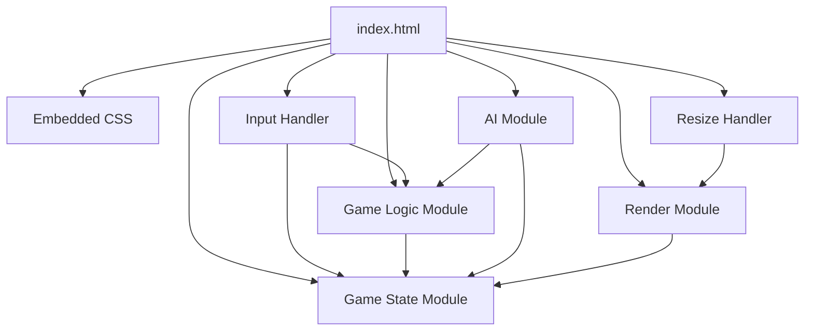
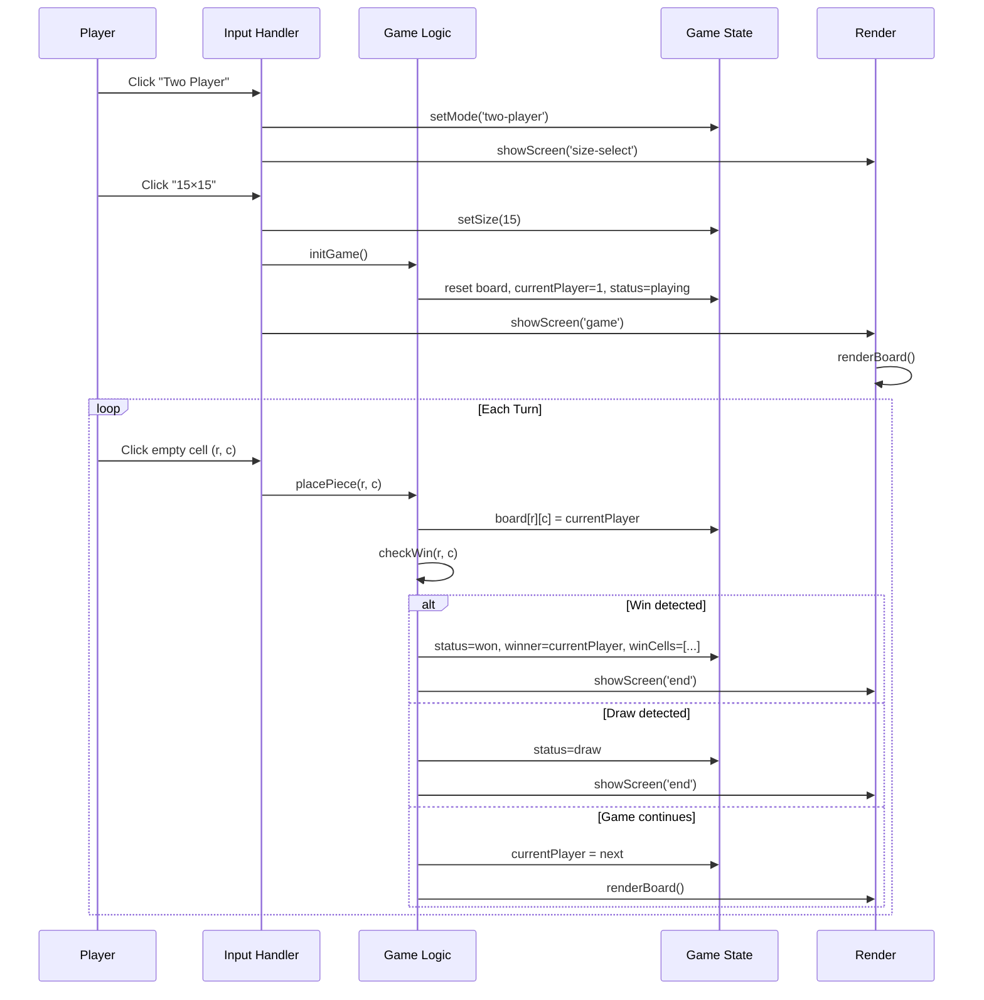
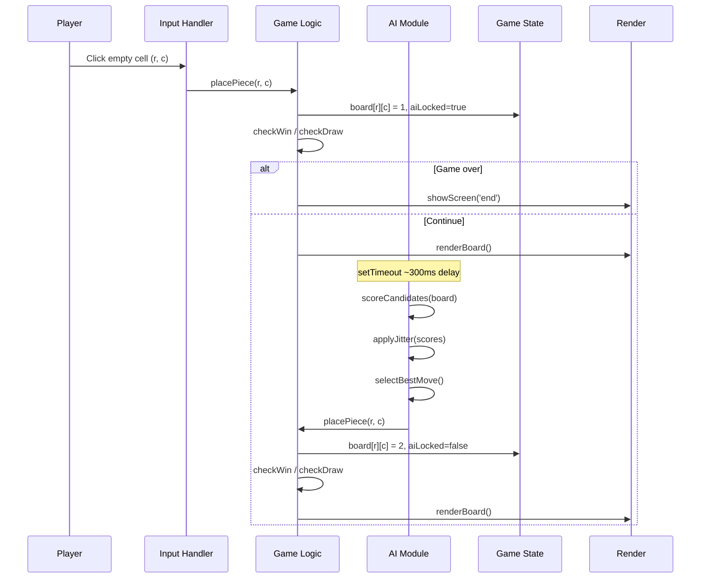
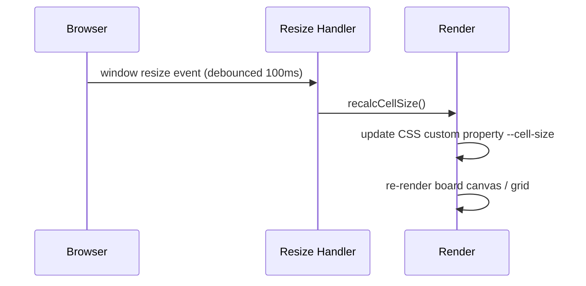

# Design Document — Connect 5

## Overview

This project is a browser-based Connect 5 game delivered as a single, self-contained HTML file with no external dependencies. It supports local two-player mode and a solo VS-AI mode on either a 15×15 or 19×19 grid. The goal is to give desktop players a premium, futuristic experience that runs instantly in any modern browser without installation or a build step.

1. The entire game — logic, rendering, and styling — lives in one HTML file.
2. The UI must feel polished and futuristic: dark theme, smooth animations, glowing pieces, highlighted wins.
3. Win detection enforces the strict overline rule: exactly five in a row wins; six or more does not.
4. The AI must feel human: scored candidate moves with random jitter so it plays well but makes occasional mistakes.
5. The board and all UI elements must resize fluidly when the browser window changes size.

Architecture philosophy: everything is a pure function or a small stateful module. Game state is a plain JavaScript object. Rendering reads from state and writes to the DOM. No framework, no build tooling, no network calls — just a single file that opens and works.

---

## Architecture

### System Components



All modules are inline `<script>` blocks within the single HTML file. There is no network layer, no server, and no external assets.

### Key Flow Diagrams

#### Primary Happy Path — Two-Player Game



#### VS-AI Flow



#### Resize Flow



---

## Components and Interfaces

Since this is a single HTML file, "components" are JavaScript modules (IIFE or plain objects) defined in `<script>` tags within `src/index.html`.

---

#### Game State Module (`src/index.html` — `GameState`)

**Purpose**: Holds the single source of truth for all mutable game data and exposes getters/setters so no other module mutates state directly.

**Process**:
1. Exposes a `state` object with fields: `mode`, `size`, `board`, `currentPlayer`, `status`, `winner`, `winCells`, `aiLocked`.
2. `init(mode, size)` resets all fields to their starting values for a new game.
3. All other modules read from `state` and call `init` or direct field assignments only through the Logic module.

---

#### Game Logic Module (`src/index.html` — `GameLogic`)

**Purpose**: Implements all game rules — piece placement, win detection (strict 5-only overline rule), draw detection, and turn management.

**Process**:
1. `placePiece(row, col)` — validates the cell is empty and game is in `playing` status; writes to `state.board[row][col]`.
2. `checkWin(row, col)` — scans all four directions (horizontal, vertical, diagonal ↘, diagonal ↗) from the placed cell. For each direction, counts the contiguous run of the current player's pieces. A win is detected if and only if the run length equals exactly 5. Returns the five winning cell coordinates or `null`.
3. `checkDraw()` — returns `true` if every cell on the board is non-zero and no winner exists.
4. `nextTurn()` — flips `state.currentPlayer` between 1 and 2.
5. After `placePiece`, calls `checkWin` then `checkDraw` in order; updates `state.status`, `state.winner`, `state.winCells` accordingly.

**Win detection detail** — for direction vector `(dr, dc)`:
- Count consecutive same-player cells in the `+(dr,dc)` direction: call it `fwd`.
- Count consecutive same-player cells in the `-(dr,dc)` direction: call it `bck`.
- Total run = `fwd + bck + 1` (the placed cell itself).
- Win if and only if `total === 5`.

---

#### AI Module (`src/index.html` — `AIPlayer`)

**Purpose**: Computes the AI's move using a heuristic scoring function with random jitter to simulate human-like imperfection.

**Process**:
1. `getBestMove(board, size)` — collects all empty cells adjacent (within 2 steps) to any occupied cell as candidates. If the board is empty, returns the center cell.
2. For each candidate cell, computes `scoreCell(board, row, col, player=2)` minus `scoreCell(board, row, col, player=1)` (attack minus defense).
3. `scoreCell` evaluates all four directions through the cell, counting open-ended runs and assigning weighted scores:
   - Open four (4 in a row, both ends free): 100,000
   - Blocked four (4 in a row, one end free): 10,000
   - Open three: 5,000
   - Blocked three: 500
   - Open two: 200
   - Single: 10
4. Adds a random jitter of `Math.random() * JITTER_FACTOR` to each candidate's score. `JITTER_FACTOR = 800` (roughly 8–16% of a blocked-three score, enough to occasionally pick a suboptimal move without playing randomly).
5. Returns the candidate with the highest jittered score.
6. AI move is triggered via `setTimeout(aiTurn, 300)` after the human places a piece, giving a natural pause.

---

#### Render Module (`src/index.html` — `Renderer`)

**Purpose**: Reads from `GameState` and updates the DOM to reflect the current state — screens, board, pieces, hover effects, and win highlights.

**Process**:
1. `showScreen(name)` — hides all screen `<div>`s and shows the one matching `name` (`menu`, `size-select`, `game`, `end`). Applies a CSS fade-in transition.
2. `renderBoard()` — builds or updates the board grid. Cell size is computed as `Math.floor(availableSize / gridSize)` where `availableSize = Math.min(viewportWidth * 0.92, viewportHeight * 0.78)`. Sets `--cell-size` CSS custom property on the board container.
3. Each cell is a `<div>` with `data-row` and `data-col` attributes. Occupied cells get a `<div class="piece player-1|player-2">` child with a CSS scale-in animation on insertion.
4. Win cells receive the class `win-highlight` which triggers a pulsing glow animation.
5. `renderStatus()` — updates the turn indicator text.
6. `renderEndScreen(result)` — sets the result message and shows the end screen.

---

#### Input Handler (`src/index.html` — `InputHandler`)

**Purpose**: Attaches all DOM event listeners and routes user interactions to the correct Logic or Render calls.

**Process**:
1. On `DOMContentLoaded`, attaches click listeners to mode buttons, size buttons, "Play Again", and "Main Menu".
2. Board click events use event delegation on the board container — reads `data-row` / `data-col` from the target, calls `GameLogic.placePiece(row, col)` if `state.status === 'playing'` and `state.aiLocked === false`.
3. Hover events on board cells add/remove `hover` class for the ghost-piece preview, skipping occupied cells and AI-locked state.

---

#### Resize Handler (`src/index.html` — `ResizeHandler`)

**Purpose**: Listens for window resize events and triggers a board re-render so cell size stays proportional to the viewport.

**Process**:
1. Attaches a `window.addEventListener('resize', ...)` listener debounced at 100ms.
2. On fire, calls `Renderer.renderBoard()` which recomputes `--cell-size` and redraws the grid at the new size.
3. Piece positions and win highlights are preserved because they are derived from `state.board` on every render.

---

## Data Models

There is no database. All state lives in memory in the `GameState` module and is lost on page reload (by design — no persistence requirement).

### Game State Object

```
state {
  mode:          string | null     // 'two-player' | 'vs-ai' | null
  size:          number | null     // 15 | 19 | null
  board:         number[][]        // 2D array [size][size], 0=empty 1=P1 2=P2
  currentPlayer: number            // 1 | 2
  status:        string            // 'idle' | 'playing' | 'won' | 'draw'
  winner:        number | null     // 1 | 2 | null
  winCells:      [number,number][] // array of [row,col] for the 5 winning cells
  aiLocked:      boolean           // true while AI is computing / animating
}
```

Example state mid-game (15×15, VS-AI, Player 1's turn):

```json
{
  "mode": "vs-ai",
  "size": 15,
  "board": [
    [0,0,0,0,0,0,0,0,0,0,0,0,0,0,0],
    [0,0,0,0,0,0,0,0,0,0,0,0,0,0,0],
    [0,0,0,1,0,0,0,0,0,0,0,0,0,0,0],
    [0,0,0,0,2,0,0,0,0,0,0,0,0,0,0],
    [0,0,0,1,0,0,0,0,0,0,0,0,0,0,0],
    [0,0,0,0,0,0,0,0,0,0,0,0,0,0,0],
    "... 9 more rows of zeros ..."
  ],
  "currentPlayer": 1,
  "status": "playing",
  "winner": null,
  "winCells": [],
  "aiLocked": false
}
```

---

## Correctness Properties

### Property Reflection Step

**Redundancies identified:**
- Requirements 5.1, 5.2, 5.3 all describe the same win-detection behavior across three directions — consolidated into one universal property covering all directions.
- Requirements 3.2 and 4.2 both describe piece placement — consolidated into one placement property.

**Gaps identified:**
- The overline rule (six-in-a-row is NOT a win) is stated in requirements but needs an explicit property to ensure it is tested.
- AI jitter behavior is implied to be bounded (not fully random) — needs a property.
- Board immutability after game-over is implied but not stated.

---

**Property 1: Turn Alternation**

*For any* sequence of valid moves in a two-player game, the player who places piece N is always the opposite player from the one who placed piece N-1, starting with Player 1 for piece 1.

**Validates: Requirements 3.1, 3.4**

---

**Property 2: Occupied Cell Immutability**

*For any* cell that already contains a piece, any attempt to place a piece on that cell leaves `state.board` identical to its state before the attempt.

**Validates: Requirement 3.3**

---

**Property 3: Win Detection Completeness (All Directions)**

*For any* board configuration where a player has exactly five consecutive pieces in a horizontal, vertical, diagonal-↘, or diagonal-↗ line with no same-player piece immediately adjacent on either end of that line, `checkWin` returns those five cells as the winning cells.

**Validates: Requirements 5.1, 5.2, 5.3**

---

**Property 4: Overline Rule — No Win on Six or More**

*For any* board configuration where a player has six or more consecutive pieces in any direction, `checkWin` does not declare a winner for that run.

**Validates: Requirements 5.1, 5.2, 5.3**

---

**Property 5: Game-Over Immutability**

*For any* game in `won` or `draw` status, calling `placePiece` on any cell leaves `state.board`, `state.status`, `state.winner`, and `state.winCells` unchanged.

**Validates: Requirements 5.4, 6.1**

---

**Property 6: Draw Completeness**

*For any* fully filled board with no five-in-a-row for either player, `checkDraw` returns `true` and `state.status` is set to `'draw'`.

**Validates: Requirements 6.1, 6.2**

---

**Property 7: AI Move Validity**

*For any* board state where it is the AI's turn, the AI always places its piece on a cell that was empty before the move, and never on an occupied cell.

**Validates: Requirements 4.2, 4.3**

---

**Property 8: AI Jitter Boundedness**

*For any* set of candidate moves scored by the AI, the jitter added to each score is in the range `[0, JITTER_FACTOR)` and the selected move has the highest jittered score among all candidates.

**Validates: Requirement 4.4**

---

**Property 9: Board Size Integrity**

*For any* game initialized with size N (15 or 19), `state.board` is always an N×N array throughout the entire game, and no piece is ever placed outside the bounds `[0, N-1] × [0, N-1]`.

**Validates: Requirements 2.2, 9.1**

---

**Property 10: Responsive Cell Size**

*For any* viewport width W and height H, the computed cell size satisfies `cellSize = Math.floor(Math.min(W * 0.92, H * 0.78) / gridSize)` and is always a positive integer.

**Validates: Requirement 9.5**

---

## Error Handling

Since this is a client-side only game with no network or persistence, error cases are limited to invalid user interactions and unexpected state.

| Error | Trigger | Behavior | Client Action |
|---|---|---|---|
| Click on occupied cell | `board[r][c] !== 0` | Silently ignored; state unchanged | None — UI provides hover feedback to guide valid clicks |
| Click during AI turn | `state.aiLocked === true` | Silently ignored | None — cursor changes to `not-allowed` during AI lock |
| Click when game over | `state.status !== 'playing'` | Silently ignored | End screen is shown; no board interaction possible |
| Invalid board size | Size not 15 or 19 passed to `init` | Defaults to 15 | N/A — only triggered by buttons with fixed values |
| Resize to very small viewport | `cellSize` computes < 1 | Clamped to minimum 4px | N/A — automatic |

**Error handling principles:**
1. All invalid interactions are silently ignored — no error messages shown to the player for normal misclicks.
2. State is never mutated on an invalid action — all validation happens before any write to `state`.
3. There are no async operations beyond `setTimeout` for AI delay; no promise rejections are possible.
4. Console warnings are emitted (not errors) for any unexpected state transitions during development.

---

## Testing Strategy

### Dual Testing Approach

This project is a pure client-side JavaScript application. Tests run in a Node.js environment using the game logic extracted as pure functions (no DOM dependency for logic tests). DOM-dependent rendering tests use jsdom.

**Unit Tests** cover:
- Specific win/draw scenarios with known board configurations
- Boundary values: pieces at corners, edges, center
- Overline cases: exactly 6, 7 in a row — must not win
- AI move selection on a near-empty board and a nearly-full board
- Screen transition sequencing
- Cell size calculation at specific viewport dimensions

**Property-Based Tests** cover:
- Universal turn alternation across random move sequences
- Occupied cell immutability across random boards
- Win detection completeness across all directions and positions
- Overline rule across random six-or-more runs
- Game-over immutability
- Draw completeness on random full boards
- AI move validity across random board states
- AI jitter boundedness across random candidate sets
- Board size integrity across random game sequences
- Cell size formula correctness across random viewport dimensions

### Property-Based Testing Configuration

- Library: `fast-check` (installed as dev dependency for test runs only; not bundled into the HTML file)
- Minimum iterations per property test: 200
- Tag format: `Feature: [feature-name], Property N: [property title]`
- Test file: `tests/connect5.test.js`

Example test structure:

```javascript
const fc = require('fast-check');
const { checkWin, placePiece, initBoard } = require('../src/logic');

// Feature: win-detection, Property 3: Win Detection Completeness
test('Property 3: win detection completeness', () => {
  fc.assert(
    fc.property(
      fc.integer({ min: 0, max: 14 }),  // row
      fc.integer({ min: 0, max: 10 }),  // col (leave room for 5 in a row)
      fc.constantFrom(1, 2),            // player
      (row, col, player) => {
        const board = initBoard(15);
        // Place exactly 5 in a horizontal row
        for (let i = 0; i < 5; i++) board[row][col + i] = player;
        const result = checkWin(board, row, col + 2, player, 15);
        return result !== null && result.length === 5;
      }
    ),
    { numRuns: 200 }
  );
});
```

### Unit Testing Focus Areas

**GameLogic:**
- `placePiece` on empty cell → piece placed, turn advances
- `placePiece` on occupied cell → state unchanged
- `checkWin` horizontal: 5 in a row at left edge, right edge, center
- `checkWin` vertical: 5 in a column at top, bottom, center
- `checkWin` diagonal ↘: 5 from top-left corner
- `checkWin` diagonal ↗: 5 from bottom-left corner
- `checkWin` overline: 6 horizontal → no win
- `checkWin` overline: 6 vertical → no win
- `checkDraw`: full board no winner → draw
- `checkDraw`: full board with winner → not draw (winner takes precedence)

**AIPlayer:**
- `getBestMove` on empty board → returns center cell
- `getBestMove` blocks an open four immediately
- `getBestMove` completes its own open four immediately
- Jitter is within `[0, JITTER_FACTOR)` range

**Renderer:**
- `recalcCellSize(1200, 800, 15)` → correct pixel value
- `recalcCellSize(800, 600, 19)` → correct pixel value
- `recalcCellSize(300, 200, 15)` → clamped to minimum

### Integration Testing

- Full game: two-player, 15×15, play to a horizontal win → end screen shows correct winner
- Full game: two-player, 19×19, play to a draw → end screen shows draw
- VS-AI game: human places piece → AI responds within 1 second → board updated
- "Play Again" from end screen → board resets, same mode and size, Player 1 starts
- "Main Menu" from end screen → menu screen shown, mode and size cleared
- Resize during game → board redraws at new size, all pieces preserved

### Test Coverage Goals

- Unit test line coverage: ≥ 90% of logic functions
- Property tests: 10 (one per property in Correctness Properties section)
- Integration tests: 6 scenarios listed above

---

## Deployment Architecture

### No Cloud Resources

This project has no cloud infrastructure. The deliverable is a single file: `src/index.html`.

Deployment = copying `src/index.html` to any static host or opening it directly in a browser.

### Environment Variables

None. The game has no server, no API keys, and no configuration.

### Deployment Steps

1. Open `src/index.html` in any modern desktop browser (Chrome, Firefox, Safari, Edge).
2. No build step, no server, no installation required.

For hosting on a static site (optional):
1. Upload `src/index.html` to any static host (GitHub Pages, Netlify, S3 static site).
2. Access via the host's URL.

### Cost and Free Tier Compliance

No cloud services used. Cost is zero.

### Security Considerations

1. No user data is collected, stored, or transmitted — no privacy or data security concerns.
2. No external scripts, fonts, or assets are loaded — no XSS vector from third-party content.
3. No `eval` or dynamic code execution — all logic is static.
4. No input is sent to any server — no injection attack surface.
5. The file can be served over HTTPS from any static host for transport security if desired.

---

## Implementation Notes

### Backward Compatibility Strategy

This is a greenfield project with no existing data or API contracts. Not applicable.

### Performance Optimizations

- **Candidate move pruning**: The AI only scores cells within 2 steps of an occupied cell, not all empty cells. On a 19×19 board this reduces candidates from up to 361 to typically 20–60, keeping AI computation under 16ms.
- **Debounced resize**: The resize handler fires at most once per 100ms to avoid thrashing the DOM during continuous resize drag.
- **Event delegation**: A single click listener on the board container handles all cell clicks, avoiding 225–361 individual listeners.
- **CSS custom property for cell size**: Changing one CSS variable (`--cell-size`) resizes the entire board without JavaScript touching individual cell styles.

### Scalability Considerations

- The game is stateless between sessions — no scaling concerns.
- The AI algorithm is O(candidates × 4 directions × board size) per move. On a 19×19 board this is well within synchronous execution limits; no web worker needed.

### Migration Path

Not applicable — greenfield single-file project.

---

## Task Breakdown

### Task 1 — Core Game Logic and AI (`src/index.html` — logic modules)

**Scope**: Implement `GameState`, `GameLogic`, and `AIPlayer` as pure JavaScript modules with no DOM dependency. This is the entire game brain.

**Deliverables**:
- `src/index.html` — contains `GameState`, `GameLogic`, `AIPlayer` script blocks
- `tests/connect5.test.js` — all logic unit tests and all 10 property tests

**Tests**: Properties 1–10, all GameLogic and AIPlayer unit tests

---

### Task 2 — Rendering, Input, and Full Game (`src/index.html` — UI modules)

**Scope**: Implement `Renderer`, `InputHandler`, and `ResizeHandler`. Wire all modules together into a playable game. Apply the full futuristic CSS theme.

**Deliverables**:
- `src/index.html` — complete file with all modules, HTML structure, and embedded CSS
- `tests/connect5.test.js` — Renderer unit tests and all 6 integration test scenarios added

**Tests**: Renderer unit tests, all integration tests

---

### Final Checkpoint

Ensure all tests pass, ask the user if questions arise.
